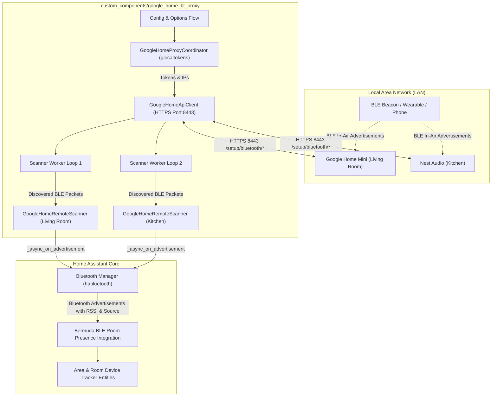
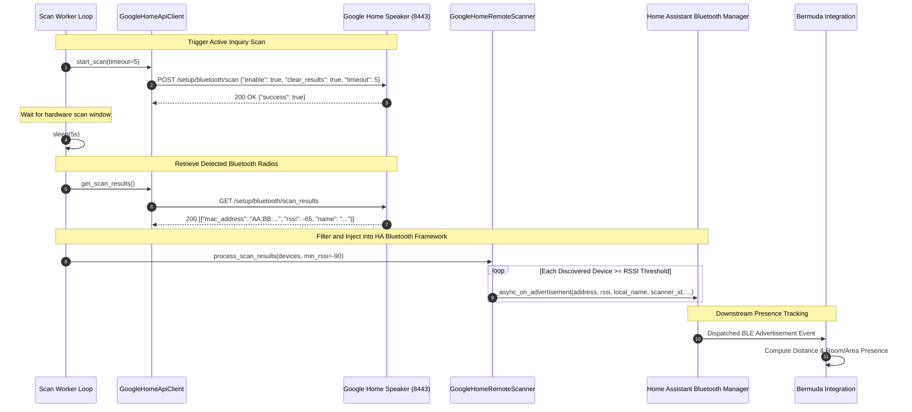

# Architecture: ha-google-home-bt-proxy

## 1. Overview

`ha-google-home-bt-proxy` turns existing Google Home and Nest speakers into native Home Assistant remote Bluetooth Low Energy (BLE) scanners (`habluetooth.BaseHaRemoteScanner`). By periodically executing local hardware inquiry scans on each speaker over HTTPS (port 8443) with authentication tokens provided by `glocaltokens`, the integration feeds real-time Bluetooth advertisement packets—complete with source MAC address, RSSI signal strength, and device identifiers—directly into Home Assistant Core's Bluetooth Manager.

Downstream integrations such as [Bermuda BLE Triangulation / Trilateration](https://github.com/agittins/bermuda) consume these native Bluetooth advertisements to provide pinpoint room-level device presence and proximity tracking without requiring auxiliary ESP32 microcontrollers or external daemons.

---

## 2. System Topology

---

## 3. Sequence Flow

The integration orchestrates periodic, staggered hardware scans across all registered Google Home speakers.

---

## 4. Component Structure & Responsibilities

| Module | File | Primary Responsibility |
|---|---|---|
| **Lifecycle Coordinator** | `__init__.py` | Initializes config entries, registers scanners via `bluetooth.async_register_scanner`, manages staggered background worker loops, and handles clean unregistration on unload. |
| **Speaker Coordinator** | `coordinator.py` | Discovers Google Home speakers via mDNS / Zeroconf (`_googlecast._tcp.local.`), authenticates using `glocaltokens` master tokens or app passwords, and coordinates token refreshes. |
| **HTTPS API Client** | `api.py` | Asynchronously executes HTTPS requests against speaker port 8443 with `cast-local-authorization-token` header, parsing `eureka_info`, `bluetooth/scan`, and `bluetooth/scan_results`. |
| **Remote Scanner Node** | `scanner.py` | Subclasses `habluetooth.BaseHaRemoteScanner`, translating raw JSON speaker payloads into Home Assistant `_async_on_advertisement` events. |
| **Configuration Flow** | `config_flow.py` | User and options UI configuration flows allowing authentication, interval tuning, scan timeouts, RSSI threshold calibration, and speaker disabling. |
| **Data Models** | `models.py` | Strongly typed dataclasses for `SpeakerNode` and `DiscoveredDevice`. |
| **Constants** | `const.py` | Configuration constants, default values, and API endpoint paths. |
| **Hardware Probe** | `scripts/probe_speaker.py` | Standalone CLI utility for discovering, authenticating, and dumping raw diagnostic endpoints directly from physical speakers. |

---

## 5. Resilience & Fault Tolerance

1. **Staggered Initialization**: To prevent network saturation and bursty load on Home Assistant's event loop, background workers are launched with a 1.5-second stagger delay per speaker.
2. **Token Expiration Recovery**: When a speaker returns HTTP 401 Unauthorized, `TokenExpiredError` is caught, prompting `coordinator.async_refresh_token(speaker)` to refresh credentials from Google servers before retrying.
3. **Exponential Backoff on Connection Drops**: Network timeouts or unreachable speakers trigger exponential backoff (1s -> 2s -> 4s -> ... up to 60s), ensuring the integration automatically self-heals when speakers reboot or re-associate with Wi-Fi.
4. **Clean Resource Teardown**: Upon integration reload or unload, worker tasks are cancelled cleanly and scanner instances are deregistered from `homeassistant.components.bluetooth`.
