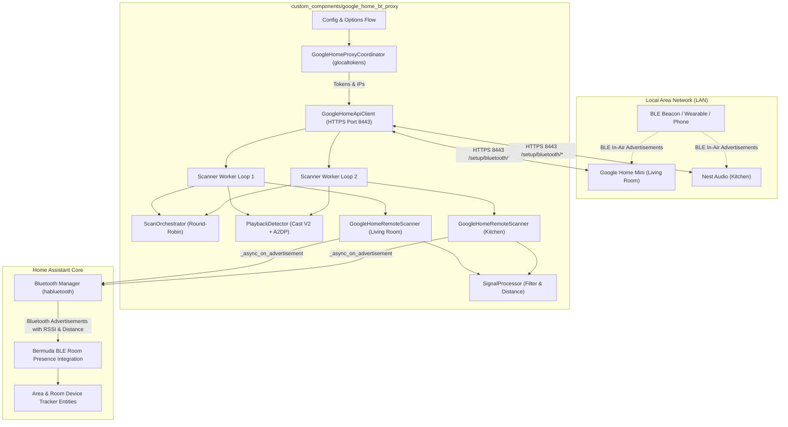
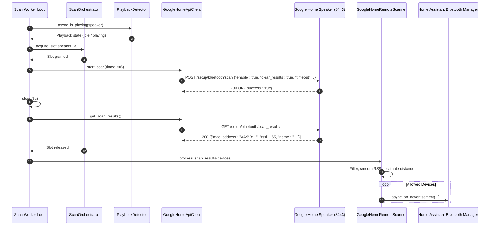

# Architecture: ha-google-home-bt-proxy

## 1. Overview

`ha-google-home-bt-proxy` turns Google Home and Nest speakers into Home Assistant remote Bluetooth Low Energy (BLE) scanners (`habluetooth.BaseHaRemoteScanner`). The integration periodically runs local inquiry scans on each speaker over HTTPS (port 8443) using authentication tokens from `glocaltokens`, and forwards discovered advertisements (MAC, RSSI, and device data) to Home Assistant's Bluetooth Manager.

Downstream integrations such as [Bermuda BLE Trilateration](https://github.com/agittins/bermuda) use these advertisements for room-level device tracking.

---

## 2. System Topology

---

## 3. Sequence Flow

The integration runs periodic hardware scans across registered speakers.

---

## 4. Component Structure

| Module | File | Responsibility |
|---|---|---|
| **Lifecycle Coordinator** | `__init__.py` | Sets up config entries, registers scanners, runs background worker loops, and handles clean teardown on unload. |
| **Speaker Coordinator** | `coordinator.py` | Discovers speakers via mDNS / Zeroconf and coordinates token retrieval using `glocaltokens`. |
| **HTTPS API Client** | `api.py` | Sends HTTPS requests to port 8443 with the `cast-local-authorization-token` header. |
| **Remote Scanner** | `scanner.py` | Implements `habluetooth.BaseHaRemoteScanner` and forwards filtered advertisements to Home Assistant. |
| **Signal Processor** | `filter.py` | Handles RSSI smoothing (median/EMA), log-distance path loss distance calculation, and MAC filtering. |
| **Scan Orchestrator** | `orchestrator.py` | Serializes scan execution across speakers in round-robin sequence to reduce 2.4GHz interference. |
| **Playback Detector** | `playback.py` | Detects media playback via Cast V2 protocol (port 8009) and Bluetooth A2DP audio (port 8443). |
| **Configuration Flow** | `config_flow.py` | Manages integration setup and options UI for global settings and per-speaker overrides. |
| **Entities** | `sensor.py`, `switch.py`, `button.py` | Exposes status and counter sensors, proxy toggle switches, and manual scan trigger buttons. |
| **IRK Resolver** | `irk.py` | Resolves iOS/macOS private resolvable addresses against user-provided Identity Resolving Keys. |
| **Data Models** | `models.py` | Dataclasses for `SpeakerNode`, `DiscoveredDevice`, and `SpeakerProxyState`. |
| **Constants** | `const.py` | Configuration keys, defaults, and API endpoint paths. |
| **Diagnostic Script** | `scripts/probe_speaker.py` | CLI tool to inspect speaker endpoints and test compatibility directly. |

---

## 5. Resilience & Fault Tolerance

1. **Staggered Initialization**: Workers start with a 1.5-second stagger delay per speaker to avoid simultaneous network requests at startup.
2. **Token Expiration Recovery**: If a speaker returns HTTP 401 Unauthorized, the integration catches `TokenExpiredError`, refreshes the token via `coordinator.async_refresh_token(speaker)`, and retries.
3. **Exponential Backoff**: Network errors and unreachable speakers trigger exponential backoff (1s, 2s, 4s... up to 60s) to handle speaker reboots and temporary Wi-Fi drops.
4. **Clean Resource Teardown**: Unloading the integration cancels background worker tasks and unregisters scanners from the Bluetooth system.
