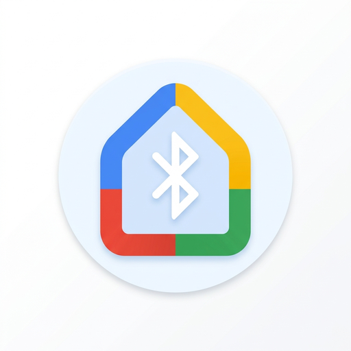
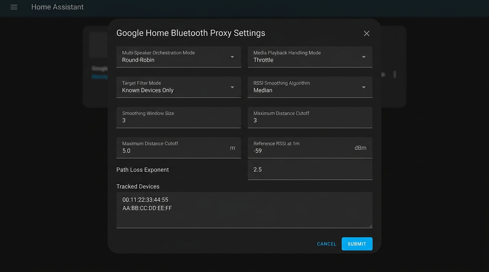
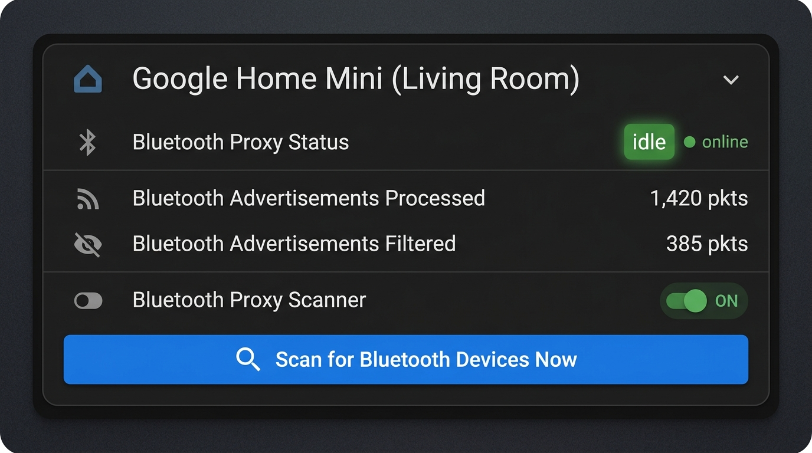

<p align="center">
  
</p>

<h1 align="center">ha-google-home-bt-proxy</h1>

<p align="center">
  <em>Turn your existing Google Home and Nest speakers into native Home Assistant Bluetooth proxies for Bermuda BLE room tracking without extra hardware.</em>
</p>

<p align="center">
  <a href="https://github.com/spelech/ha-google-home-bt-proxy/actions/workflows/ci.yml"></a>
  <a href="LICENSE"></a>
  <a href="https://www.python.org/downloads/"></a>
  <a href="https://www.home-assistant.io/"></a>
</p>

---

## 🎯 Features

- **Native Bluetooth Remote Scanner**: Implements `habluetooth.BaseHaRemoteScanner` to inject discovered Bluetooth advertisements directly into Home Assistant's native Bluetooth Manager.
- **Advanced Signal Processing & RSSI Smoothing**: Rolling median and Exponential Moving Average (EMA) filters to reject multipath flutter, antenna bounce, and signal spikes.
- **Log-Distance Path Loss Distance Estimation**: Dynamically estimates physical distance in meters ($d = 10^{\frac{\text{ref\_power} - \text{RSSI}}{10 \times n}}$) with customizable absorption exponents and reference power.
- **Floor Boundary & Distance Gating**: Drop distant or cross-floor advertisements exceeding `max_distance` to eliminate adjacent-room false triggers.
- **Ephemeral MAC Filtering & Target Whitelisting**: Three selective filtering modes (`all`, `known_only`, `whitelist`) to suppress random ephemeral MACs (RPAs) and eliminate event bus noise.
- **Synchronized Round-Robin Scan Orchestrator**: Serializes active 2.4GHz hardware inquiry scans across multi-speaker setups to prevent packet collisions and Wi-Fi throughput drops.
- **Autonomous Playback Protection**: Direct, standalone Cast V2 and Bluetooth A2DP audio streaming detection that automatically pauses or throttles BLE inquiry scans during active playback without coupling to Home Assistant's `media_player` entities.
- **Hierarchical Per-Speaker Overrides**: Customize scan intervals, scan timeouts, playback modes, and RF offsets per speaker or fall back to global entry defaults.
- **Operational Diagnostics & Controls**: First-class Home Assistant entities per speaker:
  - `sensor.*_bluetooth_proxy_status`: Live scanning lifecycle state (`idle`, `waiting_slot`, `scanning`, `playback_throttled`, etc.).
  - `sensor.*_bluetooth_advertisements_processed`: Monotonic counter of packets successfully injected.
  - `sensor.*_bluetooth_advertisements_filtered`: Real-time counter of dropped packets suppressed by distance or target filters.
  - `switch.*_bluetooth_proxy`: Instantly enable or disable scanning on individual speakers.
  - `button.*_trigger_bluetooth_scan`: Manually trigger an on-demand hardware inquiry scan.
- **Self-Healing Connection**: Automatically handles Google local authorization token renewal via `glocal tokens` and recovers from temporary Wi-Fi drops with exponential backoff.
- **Empirical Diagnostic Probe**: Includes `scripts/probe_speaker.py` for testing, classifying, and verifying speaker endpoints (`/setup/bluetooth/scan`, `/setup/bluetooth/scan_results`, Cast V2 socket) from the command line.

---

## 📸 Screenshots & UI

<p align="center">
  
  <br>
  <em>Advanced Options Flow with Multi-Speaker Orchestration, Distance Gating, and RSSI Smoothing</em>
</p>

<p align="center">
  
  <br>
  <em>Lovelace Device Card showing Operational Status, Processed vs Filtered Packets, Switch, and Scan Trigger</em>
</p>

---

## 📱 Hardware Compatibility Matrix

For an exhaustive hardware breakdown, see the complete [Hardware Compatibility Matrix](docs/hardware_matrix.md).

| Hardware Device | Subsystem / OS | BLE Proxy | Playback Detection | Role & Status |
| :--- | :--- | :---: | :---: | :--- |
| **Google Home Mini** (1st Gen) | CastOS / ARMv7 | ✅ Full | ✅ Cast V2 + A2DP | **Recommended**: High performance distributed scanner |
| **Google Nest Mini** (2nd Gen) | CastOS / ARMv8 | ✅ Full | ✅ Cast V2 + A2DP | **Recommended**: Sensitive RF front-end |
| **Google Home / Home Max / Nest Audio**| CastOS / ARMv7/v8 | ✅ Full | ✅ Cast V2 + A2DP | **Fully Supported**: Full setup API and BLE scanner |
| **Google Nest Hub / Hub Max** | Fuchsia / CastOS | ⚠️ Partial | ✅ Cast V2 | **Notice**: Display radios prioritize Zigbee/Thread time-slicing |
| **Android TV / Google TV (SHIELD, Smart TVs)** | Android TV OS | ❌ Ineligible | ✅ Cast V2 | **Playback-Only**: Bluetooth managed by Android OS (Port 8443 returns 404) |
| **Third-Party Cast Soundbars** | OEM Cast Linux | ❌ Ineligible | ✅ Cast V2 | **Playback-Only**: Firmware rejects scan commands with 400 Bad Request |
| **Google Cast Groups** | Virtual mDNS | ❌ Ineligible | ✅ Cast V2 | **Filtered**: Automatically skipped (no physical radio) |

---

## 🚀 Quickstart

### 1. Installation

#### HACS (Custom Repository)
1. In Home Assistant, open **HACS** > **Integrations**.
2. Click the three dots in the top-right corner > **Custom repositories**.
3. Enter `https://github.com/spelech/ha-google-home-bt-proxy` as the Repository and select **Integration** as the Category.
4. Search for **Google Home Bluetooth Proxy**, click **Download**, and restart Home Assistant.

#### Manual Installation
Clone or download this repository and copy `custom_components/google_home_bt_proxy` into your Home Assistant `config/custom_components/` directory:

```bash
cp -r custom_components/google_home_bt_proxy /path/to/homeassistant/config/custom_components/
```
Restart Home Assistant.

---

### 2. Configuration

1. In the Home Assistant UI, go to **Settings** > **Devices & Services** > **Add Integration**.
2. Search for **Google Home Bluetooth Proxy**.
3. Provide your Google Account credentials:
   - **Recommended**: Provide your Google **Master Token** (`oauth2_rt_...`) and **Android ID** (or use the companion browser extension).
   - **Alternative**: Enter your Google account email and an App Password.
4. Once authenticated, the integration discovers all Google Home and Nest speakers on your local network and registers a Bluetooth scanner proxy for each enabled speaker.

#### Configuration Options
Access **Configure** on the integration card to adjust global defaults or configure specific speakers (see [Signal Processing Technical Guide](docs/signal_processing.md) for formulas and calibration guidelines):
- **Configure Specific Speaker**: Select any speaker to customize its individual parameters, or select `Global Settings` to set integration-wide defaults.
- **Multi-Speaker Orchestration** (`orchestration_mode`): Serializes active hardware scans across speakers using `round_robin` to eliminate 2.4GHz Wi-Fi/BT inquiry contention, or `independent` (default: `round_robin`).
- **Hardware Scan Duration** (`scan_timeout`): Duration in seconds for each active inquiry scan on the speaker (default: `5s`).
- **Interval Between Scans** (`scan_interval`): Cooldown pause between scans (default: `10s`).
- **Minimum RSSI Threshold** (`rssi_threshold`): Discards weak or fringe signals below this dBm value (default: `-90 dBm`).
- **RSSI Calibration Offset** (`rssi_offset`): Hardware calibration adjustment in dBm applied before smoothing and distance estimation (default: `0 dBm`).
- **Target Filter Mode** (`filter_mode`): Selective ingestion mode: `all`, `known_only` (named or IRK-resolved devices), or `whitelist` (default: `all`).
- **Tracked Devices** (`tracked_devices`): Comma-separated list of MAC addresses, OUI prefixes (e.g. `AA:BB:CC`), or name substrings (e.g. `Beacon`, `Tile`).
- **RSSI Smoothing Algorithm** (`rssi_filter_mode`): Multi-sample algorithm: `none`, `median` (recommended for outlier rejection), or `ema` (default: `median`).
- **Smoothing Window Size** (`rssi_filter_window`): Number of historical samples retained for smoothing (default: `3`).
- **Maximum Distance Cutoff** (`max_distance`): Boundary threshold in meters. Advertisements estimated beyond this distance are dropped to prevent cross-room/floor bleed (`0.0` disables cutoff, default: `0.0m`).
- **Reference RSSI at 1 Meter** (`ref_power`): Expected signal strength in dBm at 1m line-of-sight for distance estimation (default: `-59 dBm`).
- **Path Loss Exponent** (`path_loss_exponent`): Environmental RF absorption factor $n$ (`2.0` = free space, `2.5 - 3.5` = indoor walls, default: `2.5`).
- **Playback Mode** (`playback_mode`): Action during active media playback: `throttle` interval, `skip_ceiling`, or `ignore` (default: `throttle`).
- **Known IRKs** (`known_irks`): Resolves iOS/macOS/watchOS private resolvable addresses (format: `name:hex_key`, one per line).

---

## 📍 Bermuda BLE Room Presence Integration

[Bermuda](https://github.com/agittins/bermuda) is a popular Home Assistant integration that tracks BLE devices (iBeacons, smartwatches, smartphones, fitness bands) and calculates which room they are in based on signal strengths reported by Bluetooth proxies.

1. **Verify Proxies in Home Assistant**:
   - Go to **Settings** > **Devices & Services** > **Bluetooth**.
   - You will see each Google Home speaker listed as a remote Bluetooth scanner (e.g. `Living Room Speaker Bluetooth Proxy`).
2. **Assign Speakers to Areas**:
   - Assign each speaker's proxy device to its corresponding physical Area/Room in Home Assistant (e.g. *Living Room*, *Kitchen*, *Office*).
3. **Configure Bermuda**:
   - Install and open the **Bermuda BLE Trilateration** integration.
   - Bermuda will automatically detect the Google Home proxy scanners from the Bluetooth framework.
   - Set each scanner's reference location/area. Bermuda will then provide room-level `device_tracker` and `sensor` entities for all tracked BLE devices.
4. **Calibrate RSSI**:
   - If using mixed generations (e.g. Nest Mini Gen 2 alongside Home Mini Gen 1), use the `rssi_offset` option on individual speakers to align reported dBm signals for balanced distance calculations.

---

## 🔍 Empirical Speaker Probing Utility

The repository includes a standalone diagnostic tool to test speaker Bluetooth scanning and classify device compatibility directly:

```bash
# Basic discovery probe (checks eureka_info and classifies device)
uv run scripts/probe_speaker.py --host 192.168.1.110

# Full inquiry scan and Cast V2 socket verification with local token
uv run scripts/probe_speaker.py --host 192.168.1.110 --token "your-token" --timeout 5 --check-cast
```

### Options:
- `--host`: IP address of your Google Home speaker, Cast TV, or soundbar.
- `--port`: HTTPS API port (default: `8443`).
- `--token`: Speaker local authorization token (optional for open status/eureka endpoints).
- `--timeout`: Hardware scan window in seconds (default: `5`).
- `--check-cast`: Probes the Cast V2 TLS control socket on port `8009`.

The script queries:
- `GET /setup/eureka_info`: Device metadata, firmware, and capabilities.
- `GET /setup/bluetooth/status`: Bluetooth subsystem readiness.
- `POST /setup/bluetooth/scan`: Triggers an active inquiry scan.
- `GET /setup/bluetooth/scan_results`: Dumps detected MAC addresses, RSSI values, and device names.
- Socket probe on port `8009`: Verifies Cast V2 media controller connectivity.
- Automatically outputs hardware classification (Fully Compatible, Android TV Playback-Only, or Third-Party Cast).

---

## 🏗️ Architecture

For in-depth architectural details, sequence flows, and subsystem diagrams, see [ARCHITECTURE.md](ARCHITECTURE.md).

---

## 🛠️ Development & Testing

This project uses `uv` for package management, `ruff` for linting and formatting, and `pytest` for testing:

```bash
# Install dependencies into virtual environment
uv sync

# Run format and lint checks
uv run ruff format --check .
uv run ruff check .

# Run pytest suite with >= 80% coverage requirement
uv run pytest --cov=custom_components/google_home_bt_proxy --cov-fail-under=80 -v
```

---

## 📄 License

This project is licensed under the MIT License - see the [LICENSE](LICENSE) file for details.
