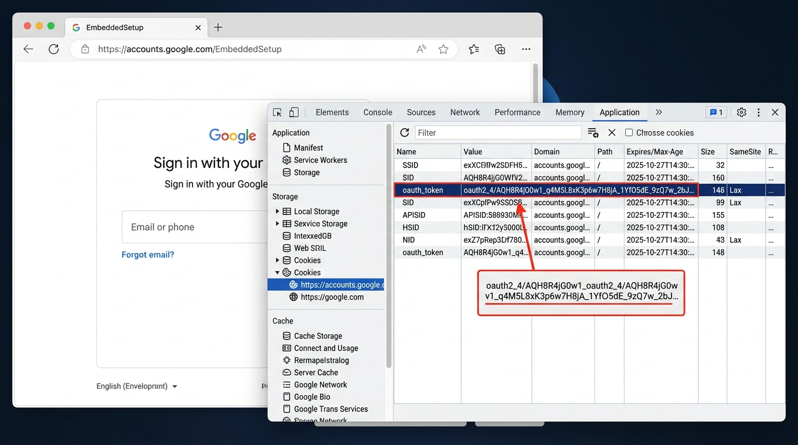
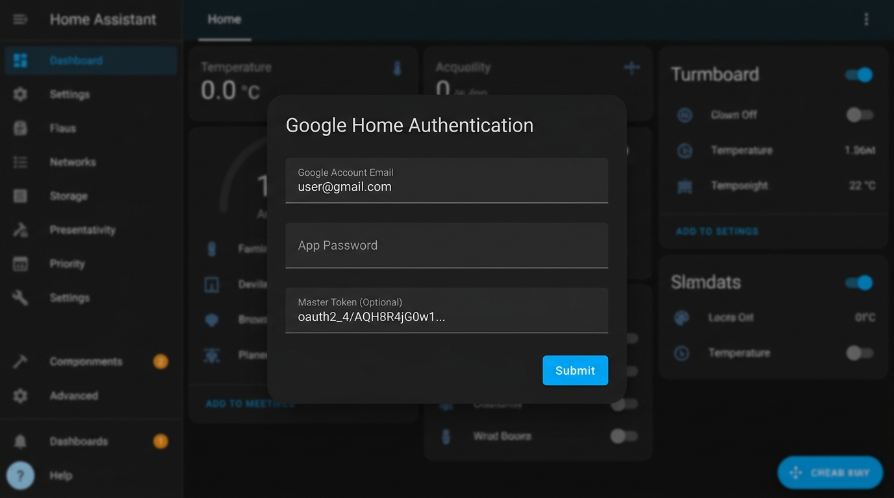

# Google Home Bluetooth Proxy: Authentication Guide

This guide walks you through authenticating Google Home Bluetooth Proxy with your Google account.

---

## Which Method Should You Use?

| Method | When to Use | Setup Time |
| :--- | :--- | :--- |
| **1. Existing `ha-google-home` Import** | You already run the [ha-google-home](https://github.com/leikoilja/ha-google-home) integration in HA | **Instant (1 Click)** |
| **2. Browser Token / Cookie Copy** | Standard setup for all Google accounts | **~30 Seconds** |

> [!NOTE]
> **Why no App Passwords?** Google has deprecated and blocked automated OAuth token generation (`gpsoauth`) via App Passwords on almost all modern accounts, returning `BadAuthentication`. Extracting a one-time browser cookie (`oauth2_4/...`) via `EmbeddedSetup` is 100% reliable, takes ~30 seconds, and avoids entering your Google account credentials into Home Assistant.

---

## Method 1: Auto-Import from Existing Google Home Integration

If you already use the popular `ha-google-home` custom component for alarms, timers, or rebooting:

1. In Home Assistant, go to **Settings** > **Devices & Services** > **Add Integration**.
2. Search for **Google Home Bluetooth Proxy**.
3. The integration detects your existing tokens automatically.
4. Click **Submit** to import credentials. No typing or token extraction required.

---

## Method 2: Browser DevTools Token Extraction

Grab a one-time token from Google in about 30 seconds using your regular desktop web browser. **No extensions or developer mode required.**

### Step 1: Open Google Embedded Setup
Open a desktop browser (Chrome, Edge, Brave, or Firefox) and navigate to:
[https://accounts.google.com/EmbeddedSetup](https://accounts.google.com/EmbeddedSetup)

Log into your Google account normally. Complete any 2FA prompts, SMS codes, or passkey prompts that Google displays, and click **"I agree"** on the setup screen.

### Step 2: Open Developer Tools to Find the Cookie
1. Once you click "I agree", press **`F12`** (or **`Ctrl+Shift+I`** on Windows/Linux, **`Cmd+Option+I`** on macOS).
2. Go to the **Application** tab in Chrome/Edge/Brave (or **Storage** tab in Firefox).
3. In the left sidebar, expand **Cookies** and click **`https://accounts.google.com`**.
4. In the table of cookies, locate the row named **`oauth_token`**.
5. Double-click the **Value** column for `oauth_token` and copy it. It starts with `oauth2_4/` (you can now close the browser tab).

### Step 3: Paste into Home Assistant
1. In Home Assistant, open the **Google Home Bluetooth Proxy** setup dialog.
2. Enter your **Google Account Email**.
3. Leave **App Password** blank.
4. Paste the copied token directly into the **Master Token (Optional)** field.

5. Click **Submit**.

The integration automatically detects the `oauth2_4/` format, exchanges it with Google's authentication service for a permanent master token (`aas_et/...`), and registers your speakers as Bluetooth proxies.

---

## Frequently Asked Questions

### Does this token expire?
No. Once Home Assistant exchanges your credentials for a master token (`aas_et/...`), the master token remains valid indefinitely unless you change your Google account password or revoke access in your Google Account security settings.

### Is my Google password stored in Home Assistant?
No. Once authenticated, only the master token and generated Android identifier are stored in Home Assistant's encrypted configuration entry store (`.storage/core.config_entries`). Your raw password is never kept.

### Why doesn't Home Assistant use a standard "Sign in with Google" button?
Standard third-party Google OAuth (used by integrations like Google Calendar or Google Nest Device Access) only provides access to public Google cloud APIs. Local Google Home speakers communicate over HTTPS port 8443 using local Cast authentication tokens (`cast-local-authorization-token`) that are only issued via Google's internal Play Services Android client (`com.google.android.gms`). Every tool in the open-source smart home ecosystem (`ha-google-home`, `glocaltokens`, `pychromecast`) uses this same authentication mechanism.
